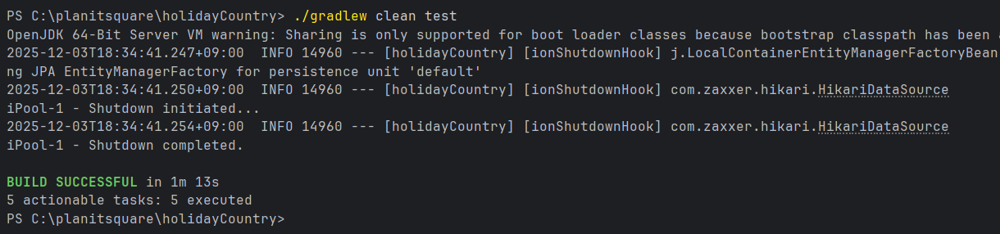

# Planitsquare – Public Holiday API Service

Planitsquare Subject Public Github Repository

**1. 빌드 & 실행 방법**

Gradle 빌드 명령어 : ./gradlew clean build

애플리케이션 실행 명령어 : java -jar build/libs/holidayCountry.jar

Swagger 접속 URL : http://localhost:8080/swagger-ui/index.html

※ 참고 OpenAPI : http://localhost:8080/v3/api-docs

---

**2. REST API 요약 명세**
  ** 2.1 공휴일 검색**
   GET /api/holiday/search

파라미터 타입 설명
year Integer 조회 연도
country String 국가 코드
type String 공휴일 타입 필터
from/to LocalDate 기간 검색
page / size Integer 페이징 옵션(default size : 50)

응답 예시
url : http://localhost:8080/api/holiday?year=2024&country=KR&page=0&size=20&sort=string

response : {
"content": [
{
"date": "2024-01-01",
"localName": "새해",
"name": "New Year's Day",
"country": "KR",
"fixed": false,
"global": true,
"counties": null,
"launchYear": null,
"types": [
"Public"
]
},
{
"date": "2024-02-09",
"localName": "설날",
"name": "Lunar New Year",
"country": "KR",
"fixed": false,
"global": true,
"counties": null,
"launchYear": null,
"types": [
"Public"
]
},...
]
}

**2.2 공휴일 재동기화 (Refresh)**
POST /api/holiday/refresh

파라미터 타입 설명
year Integer 조회 연도
country String 국가 코드

url : http://localhost:8080/api/holiday/refresh?year=2022&country=KR

response : [
{
"date": "2022-01-01",
"localName": "새해",
"name": "New Year's Day",
"country": "KR",
"fixed": false,
"global": true,
"counties": null,
"launchYear": null,
"types": [
"Public"
]
},
{
"date": "2022-01-31",
"localName": "설날",
"name": "Lunar New Year",
"country": "KR",
"fixed": false,
"global": true,
"counties": null,
"launchYear": null,
"types": [
"Public"
]
},...
]

**2.3 공휴일 삭제**
DELETE /api/holiday

파라미터 타입 설명
year Integer 삭제 대상 연도
country String 국가 코드

url : http://localhost:8080/api/holiday?year=2022&country=KR

response: status code 204

**2.4 국가 조회**
GET /api/country

3. ./gradlew clean test 성공 스크린샷
   ./gradlew clean test
   

4. Swagger UI 또는 OpenAPI JSON 확인 방법

Swagger 접속 경로 : http://localhost:8080/swagger-ui/index.html
OpenAPI JSON 노출 URL : http://localhost:8080/v3/api-docs

---

**5. 프로젝트 개요** 
   목적
   국가별 공휴일 수집/저장/조회 서비스 구축
   데이터 중복 방지 및 재동기화 기능 제공
   REST API 기반의 확장 가능한 구조

핵심 기능
최근 5년(2020~2025) 공휴일 데이터 일괄 적재
다중 필터 기반의 공휴일 검색
연도·국가 조합의 재동기화(Refresh)
연도·국가 공휴일 삭제

**6. 기술 스택**
   항목 내용
   Framework Spring Boot 3.2.5
   ORM JPA, Hibernate, QueryDSL
   DB H2
   API Docs Springdoc OpenAPI (Swagger UI)
   외부 API Nager.Date Public Holiday API

**7. 트러블슈팅**
   아래 문제들은 프로젝트 진행 과정에서 실제 기능 개발을 막았던 순서대로 정리한 목록입니다.

[1순위 — 빌드/실행 차단 이슈]

Gradle Native Services 오류
(“Could not initialize native services” 발생으로 빌드 전체 중단)

application.properties 버전 충돌로 인한 Gradle 빌드 실패
(Spring Boot 3.x / 의존성 버전 불일치로 실행 자체 불가)

[2순위 — 핵심 기능 차단 이슈]

Swagger UI 500 오류 — /v3/api-docs Fetch Error
(API 문서 및 테스트 불가)

외부 API JSON 파싱 오류 — RestClientException / 타입 불일치
(공휴일 적재·Refresh 기능 전체 중단)

---

**8. 트러블슈팅 상세 정리**
아래는 위 문제들을 해결하기 위해 수행한 문제 → 조치 → 해결을 상세히 정리한 섹션입니다.

8.1 Gradle Native Services 오류 — Could not initialize native services
문제

빌드 시 Gradle 자체가 실행되지 않음.
JNI 라이브러리 로딩 실패로 모든 작업(빌드/테스트/실행)이 차단됨.

조치

Gradle wrapper 버전 확인 및 JDK 17과 호환되는 버전으로 재설정

~/.gradle 캐시 삭제 후 새로 다운로드

프로젝트 내 gradle-wrapper.properties를 정상 상태로 통합

OS 권한 문제 및 zip 손상 여부 점검

해결

빌드 환경이 정상화되면서 테스트·QueryDSL·실행 모두 복구됨.
환경 버전 관리의 중요성을 확인할 수 있었던 이슈.

8.2 application.properties 버전 충돌로 인한 Gradle 빌드 실패
문제

Spring Boot 3.x와 맞지 않는 설정 키 또는 의존성 조합이 포함되어 있어
빌드 및 서버 실행이 반복적으로 실패.

조치

Boot 3.x 기준 문서 기반으로 설정 전수검사

hibernate, springdoc, logging 관련 키를 최신 방식으로 통일

gradle 의존성 트리에서 충돌 라이브러리를 제거 및 버전 정리

해결

빌드 실패 원인이 제거되었고, Swagger / QueryDSL / Hibernate 가 정상 동작.
프로젝트 전체 안정성의 기반을 마련.

8.3 Swagger UI 500 오류 — “/v3/api-docs Fetch Error”
문제

Swagger UI는 열리지만 API 스키마 JSON이 500 오류로 응답됨 → 문서 기능 전부 불가.

조치

Spring Boot 3.x 호환 버전으로 springdoc 의존성 변경

implementation 'org.springdoc:springdoc-openapi-starter-webmvc-ui:2.3.0'

WebMvc 설정 충돌 제거

base-package 설정 재확인

해결

/swagger-ui/index.html 및 /v3/api-docs 정상 동작.
제출 요구사항의 핵심 기능(문서 노출 및 API 테스트) 완전 충족.

8.4 외부 API JSON 파싱 오류 — RestClientException / 타입 불일치
문제

Nager API의 JSON 구조와 DTO 타입 불일치, LocalDate 파싱 문제로
외부 API 호출 결과 매핑이 실패하면서 적재·재동기화 기능 전체가 중단됨.

조치

Nager 공식 스키마와 DTO 필드 1:1 재매칭

LocalDate 파싱을 검증하고 필요한 경우 @JsonFormat 적용

types 배열은 List<String> 형태로 교정

불필요한 필드 제거하여 구조 단순화

해결

API 데이터 수집 기능(초기 5년 적재 + Refresh)이 모두 정상화됨.
실 데이터 기반의 기능 요구사항을 온전히 충족.

